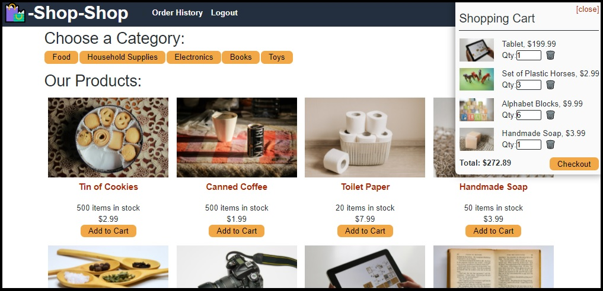

# Shop Shop Redux - React Pathway

This project is a full stack application that allows users to purchase things, items, and products from a virtual storefront.

Check it out here: [Shop Shop Redux](https://shop-shop-redux-dan-mueller.herokuapp.com/)

## What does it do?
- Users may create accounts using a username, email address, and password.
- Users can log in.
- Users can view a page of available products.
- Users can filter the products they see by category.
- Users can view detailed information about a product.
- Users can add products to a shopping cart.
- Users can modify the quantity of items in their shopping cart.
- Users can remove items from their shopping cart.
- Logged in users can complete their purchase using Stripe.
- After submitting payment information, users are redirected back to the products view.

## Tools/Technologies
- Back end - Node.js, GraphQL using Apollo Server, MongoDB, Mongoose.js
- Front end - React.js, React Bootstrap, GraphQL with Apollo Boost, Redux

## Project Scope
Working code was provided for this project, with the front-end state of the project being managed using the Context API. The code was refactored to replace the Context API with Redux.
